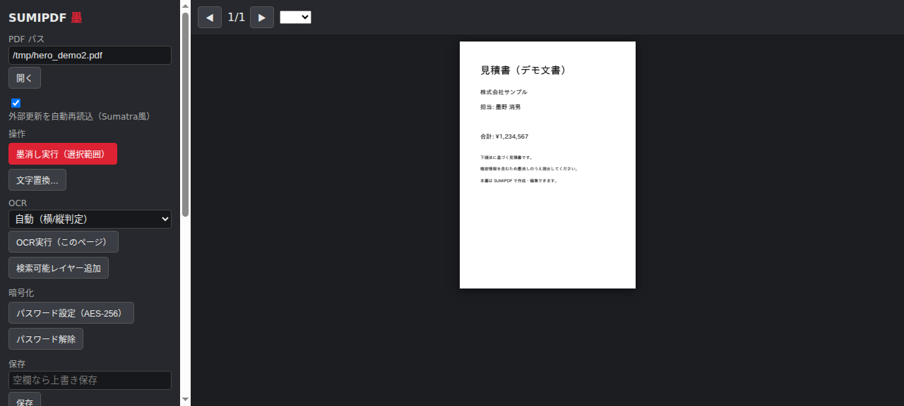

<p align="center">
  
</p>

<h1 align="center">SUMIPDF（墨）</h1>

<p align="center">
  <b>ローカル完結・MITライセンスのPDF編集ツール</b><br>
  真の墨消し ／ 文字置換 ／ OCR ／ 暗号化 ／ ページ操作 ／ Sanitize ／ MCPサーバ内蔵
</p>

<p align="center">
  <a href="https://github.com/tsubotan1985/sumi-pdf/releases/latest"></a>
  <a href="LICENSE"></a>
  
  
  
</p>

---

<p align="center">
  
</p>

## なぜSUMIPDFか

一般的な「黒塗りPDF」は**黒い矩形を上に乗せているだけ**で、下のテキストや画像はファイルに残ります。SUMIPDFの墨消しは**コンテンツストリームからテキスト命令を削除し、埋め込み画像の画素そのものを書き換える**ため、データが物理的に消えます。

| | 黒塗り（一般的なツール） | SUMIPDF |
|---|---|---|
| テキスト | 残る（コピー・検索で復元可） | **削除** |
| 画像内の個人情報 | 残る | **画素を書き換え** |
| 復元 | 容易 | **不可能** |

## 機能

- **真の墨消し** — テキストはコンテンツストリームの表示命令を削除、画像はピクセルを直接書き換え（`/api/img-redact`）。背景色でのなじませ塗り・残文字の座標復元付き
- **文字置換** — 同一ベースラインにIPAexで再挿入。行の部分置換では前後の文字を1文字ずつ再構築
- **OCR** — NDLOCR-Lite（縦書き・手書き・古典）＋ tesseract（jpn/jpn_vert 自動判定）。スキャンPDFを検索可能化（不可視テキスト層）
- **暗号化** — AES-256/128 パスワード設定・解除・権限制御（印刷/コピー等のフラグ）
- **ページ操作** — 回転・削除・抽出・結合・挿入・全ページ分割
- **Stirling系ユーティリティ** — 圧縮（画像再エンコード）／透かし／ページ番号／メタデータ編集／Sanitize（JavaScript・添付ファイル・メタデータの一括除去）
- **ライブリロード** — SumatraPDF方式。ファイルをロックせずメモリから開き、外部更新を検出して自動再読込（未保存編集時は保護）
- **フォントフォールバック** — MS明朝/ゴシック・Yu・Meiryo等をシステム参照。無ければ同梱 IPAex/Noto/Liberation。文字化けフォント名も自動正規化
- **MCPサーバ** — 15ツール。Hermes / Claude Code から直接PDF操作

## クイックスタート（Windows）

1. [Releases](https://github.com/tsubotan1985/sumi-pdf/releases/latest) から `SUMIPDF-vX.Y.Z-win64.zip` をダウンロード
2. 解凍して `SUMIPDF.exe` を実行（インストーラ不要・ポータブル）

> OCRエンジン（tesseract）を有効化する場合: `winget install UB-Mannheim.TesseractOCR`
> 辞書（jpn/jpn_vert/eng）は同梱済み。NDLOCR-Liteモデルは同梱ビルドに含まれないため、
> 利用する場合は `scripts/setup_third_party.sh` で別途取得してください

## MCPサーバ

`sumi_pdf.mcp_server` — 依存ゼロの stdio JSON-RPC。登録例:

```
hermes mcp add sumi-pdf -- python -m sumi_pdf.mcp_server
```

主なツール: `redact_pdf` / `replace_text` / `img_redact_pdf` / `compress_pdf` / `watermark_pdf` / `page_numbers_pdf` / `get_metadata` / `set_metadata` / `sanitize_pdf` / `encrypt_pdf` / `decrypt_pdf` / `pdf_permissions` / `extract_text` / `inspect_fonts` / `ocr_pdf_page`

## HTTP API（127.0.0.1:8765）

`/api/open` `/api/page/{n}` `/api/redact` `/api/img-redact` `/api/replace` `/api/save` `/api/ocr/{n}` `/api/ocr-layer` `/api/encrypt` `/api/decrypt` `/api/compress` `/api/watermark` `/api/page-numbers` `/api/metadata` `/api/sanitize` `/api/rotate` `/api/pages/delete` `/api/extract` `/api/merge` `/api/insert` `/api/split` ほか

## ソースから実行 / ビルド

```
py -3.12 -m venv .venv
.venv\Scripts\pip install -e .[app,build,test]
.venv\Scripts\python run_app.py      # WebView2ウィンドウ
```

PyInstallerでビルドする場合（pymupdfは含めない — MIT構成）:

```
.venv\Scripts\python -m PyInstaller --noconfirm --windowed --name SUMIPDF --icon resources\icon.ico ^
  --add-data "fonts;fonts" --add-data "web;web" --add-data "tools\tessdata;tools\tessdata" ^
  --collect-all uvicorn --collect-all webview run_app.py
```

## 同梱物とライセンス

- 本体: **MIT**（`LICENSE`）
- エンジン: pypdf (BSD-3) / pypdfium2 (Apache-2.0・BSD) / reportlab (BSD) / Pillow (MIT-CMU) — **AGPL成分なし**
- フォント: IPAex（IPAフォントライセンス）/ Noto Sans CJK（OFL）/ Liberation（OFL）→ `fonts/LICENSES.md`
- OCR: tesseract（Apache-2.0・外部インストール）＋ tessdata_fast（同梱）/ NDLOCR-Lite（国立国会図書館、CC-BY-4.0・**同梱しないオプション**: `scripts/setup_third_party.sh` で別途取得）

詳細は `THIRD-PARTY-NOTICES.md`。MS/Yu/Meiryo 系フォントは同梱せずシステム参照のみ。

## 開発の経緯

Windows用PDF編集ソフトの機能を調査し、**ローカル完結・オープンソース**で同等機能を実装したものです。クラウド送信なしで個人情報を含むPDFを安全に処理することを目的としています。
